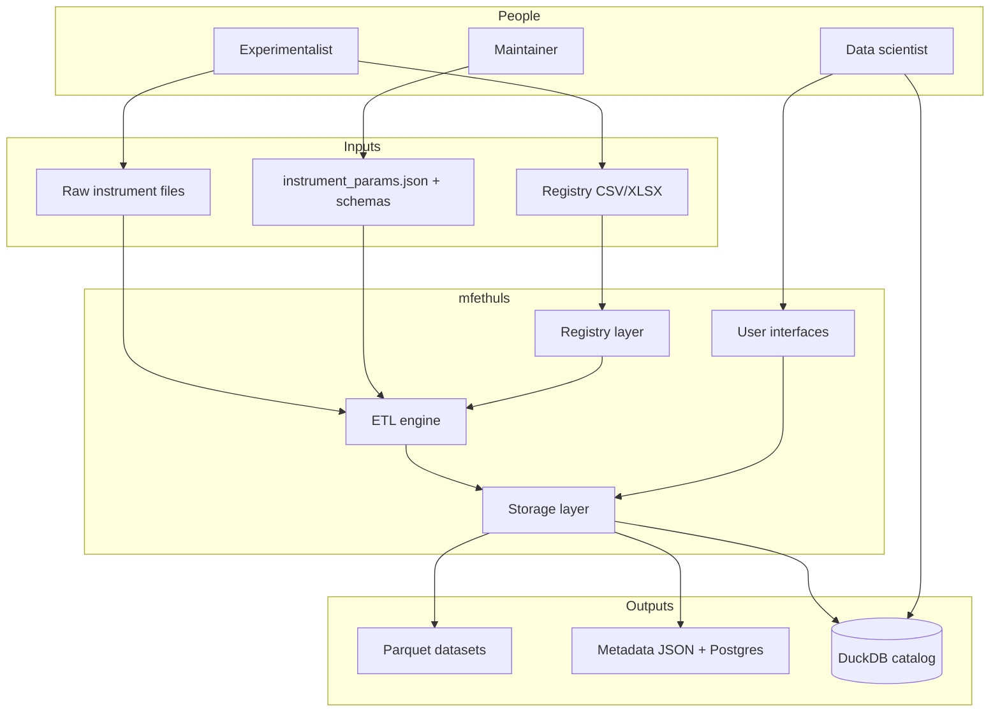
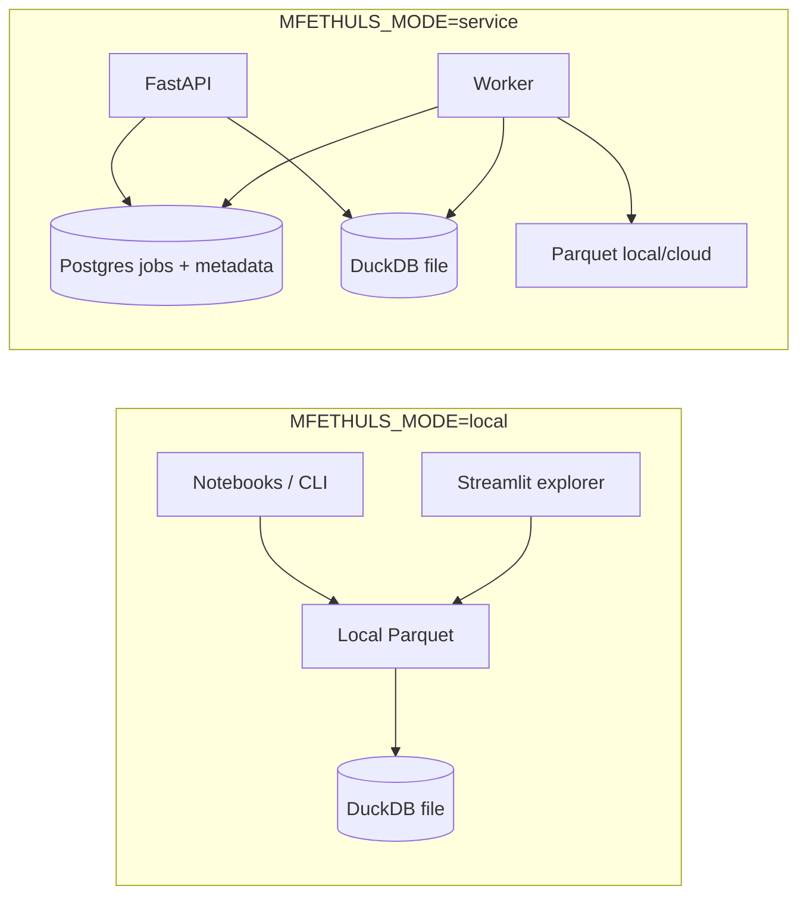
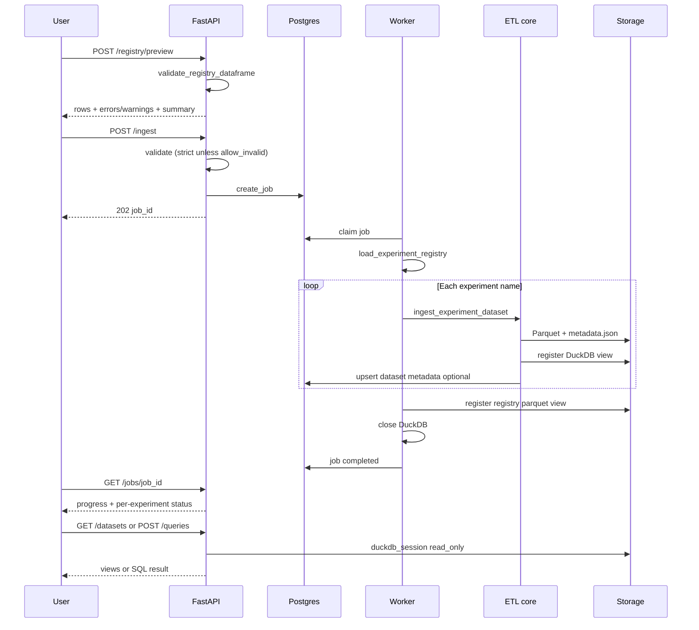
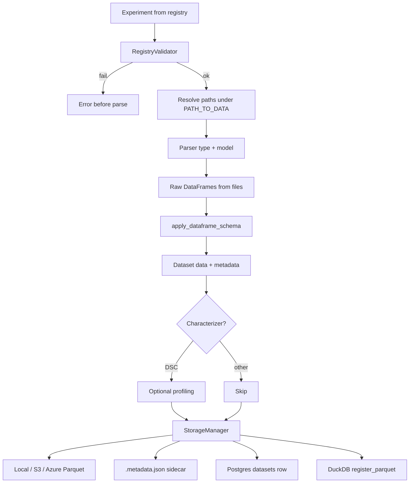
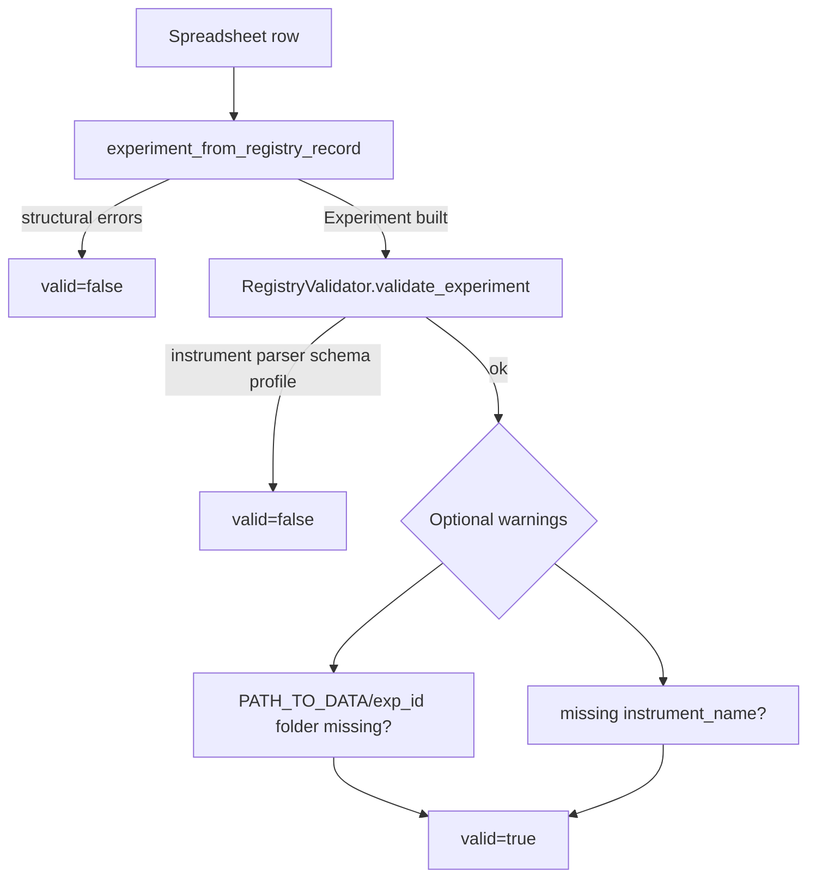
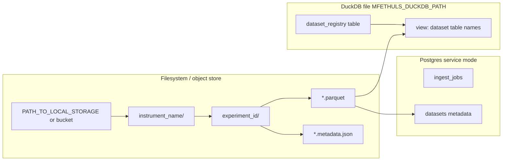

# mfethuls architecture

mfethuls bridges laboratory instrument exports and analysis-ready datasets: a **registry** (spreadsheet) describes experiments; an **ETL pipeline** parses and normalizes data; **storage and query layers** expose Parquet, metadata, and SQL.

## System context



| Role | Owns |
|------|------|
| Experimentalist | Registry rows, descriptions, measurement profiles |
| Maintainer | Parsers, schema JSON, instrument config |
| Data scientist | Queries, notebooks, downstream BI |

## Deployment modes



- **Local:** no Postgres required; ingest writes Parquet and registers DuckDB views on disk.
- **Service:** API queues jobs in Postgres; worker runs the same ingest pipeline; API queries DuckDB **read-only per request**; worker **closes DuckDB after each job** so both can share one database file.

## End-to-end ingest pipeline



## ETL core (single experiment)



**Key modules:**

| Step | Module |
|------|--------|
| Registry load | `experiments.py` — `experiment_from_registry_record`, `load_experiment_registry` |
| Validation | `registry_validator.py` — `validate_registry_dataframe`, `RegistryValidator.validate_experiment` |
| Orchestration | `config/loader.py` — `ingest_experiment_dataset`, `load_experiment_dataset` |
| Parse | `factory.py`, `parsers/*` |
| Normalize | `schema_normalization.py`, `config/schemas/*.json` |
| Persist | `storage/manager.py`, `storage/backends.py`, `storage/metadata.py` |
| Query catalog | `storage/duckdb_backend.py` |

## Registry validation (preview = worker pre-checks)



## Storage layout



## User interfaces

| Interface | Mode | Purpose |
|-----------|------|---------|
| `mfethuls` CLI / notebooks | local | Load, compare, plot experiments |
| `apps/streamlit_app.py` | local | Ingest sidebar, browse DuckDB, ad-hoc plots |
| FastAPI (`mfethuls/api`) | service | Preview, ingest jobs, list datasets, SQL |
| Worker (`mfethuls/worker.py`) | service | Background ingest |
| External BI | either | Connect to DuckDB file, Postgres `datasets`, or Parquet paths |

## Package map

```
src/mfethuls/
  experiments.py      # Registry model + load
  registry_validator.py
  factory.py            # Paths + parse_experiment
  parsers/              # Instrument parsers
  schema_normalization.py
  dataset.py            # Dataset contract
  config/loader.py      # Ingest orchestration
  storage/              # Parquet, Postgres, DuckDB, jobs
  api/                  # FastAPI routes
  worker.py             # Job processor
  plotting/             # Optional viz (viz extra)
```

## Related docs

- [ROADMAP.md](../ROADMAP.md) — product priorities
- [SCHEMA_CONTRACT.md](../SCHEMA_CONTRACT.md) — canonical columns
- [ingest_preview_contract.md](ingest_preview_contract.md) — API payloads
- [database_integration.md](database_integration.md) — Postgres + Parquet design notes
