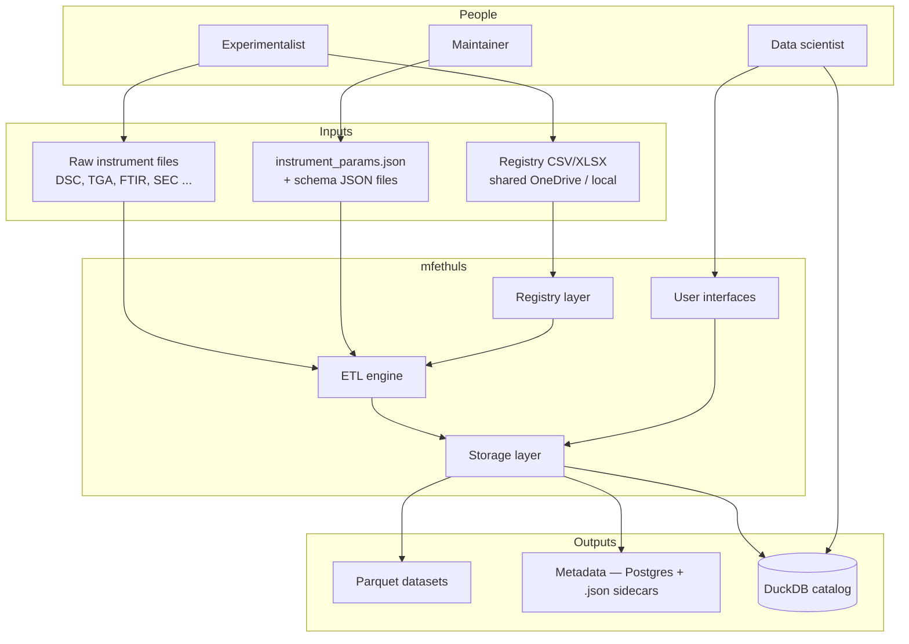
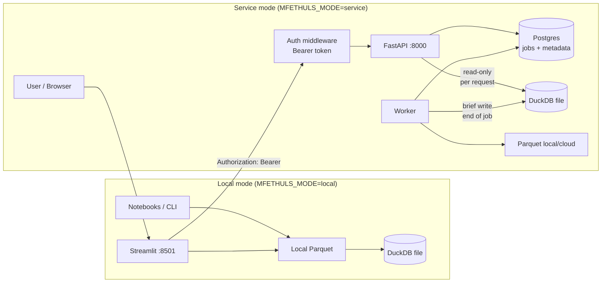
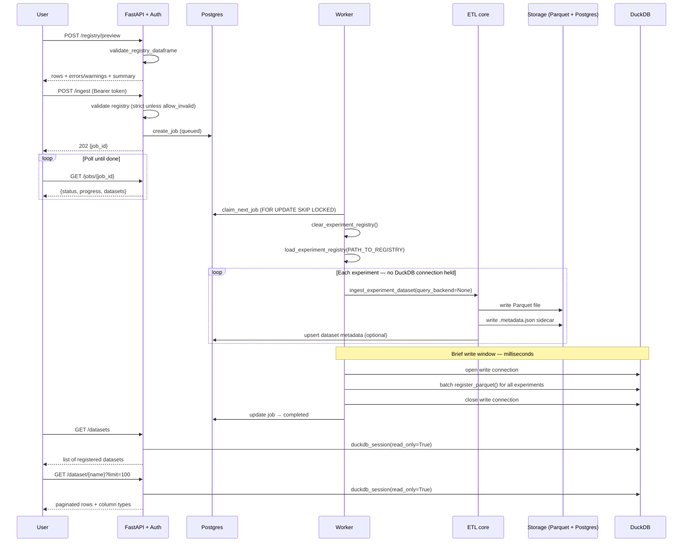
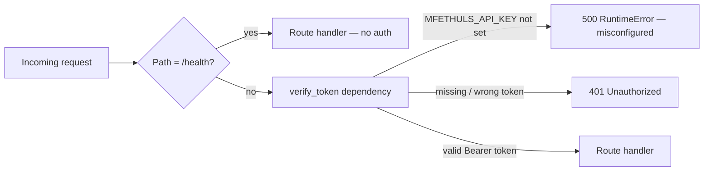
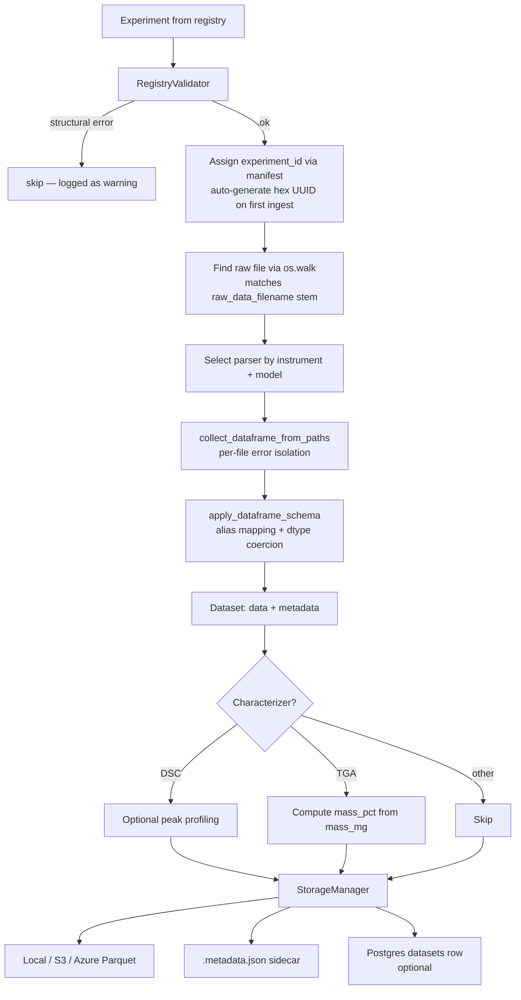
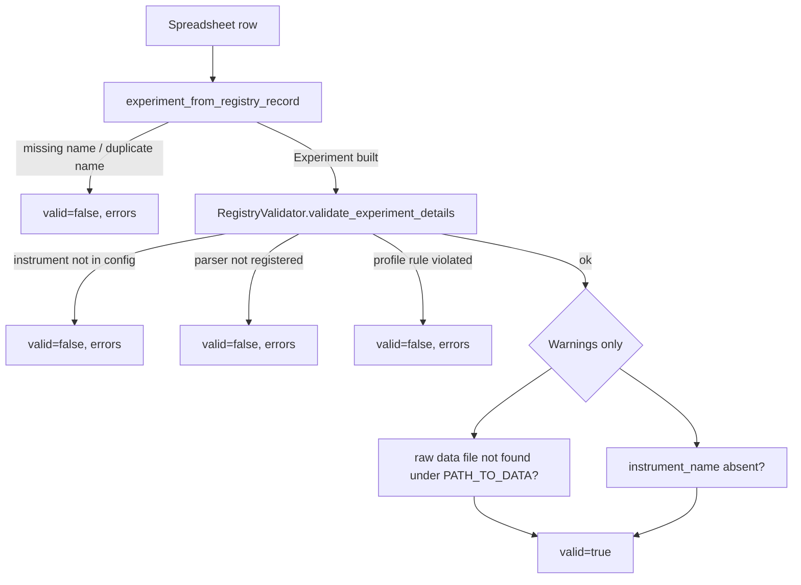
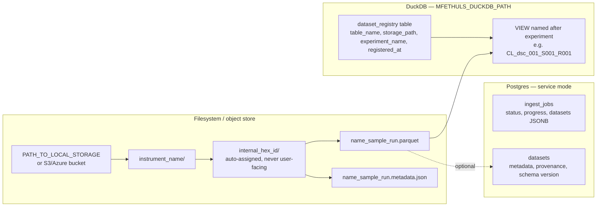
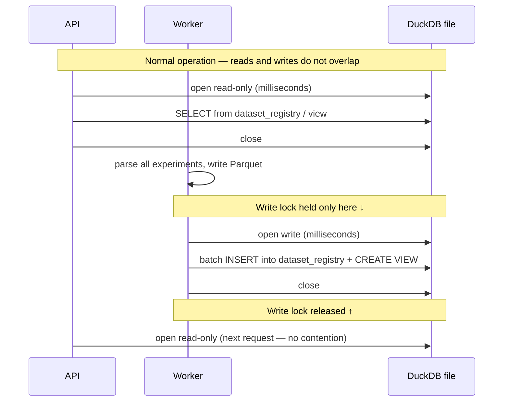

# mfethuls architecture

mfethuls bridges laboratory instrument exports and analysis-ready datasets: a **registry** (spreadsheet) describes experiments; an **ETL pipeline** parses and normalizes raw data; **storage and query layers** expose Parquet, metadata, and SQL to users and BI tools.

---

## System context



| Role | Responsibilities |
|------|-----------------|
| Experimentalist | Registry rows, descriptions, measurement profiles, raw data files |
| Maintainer | Parsers, schema JSON, instrument config |
| Data scientist | Queries, notebooks, downstream BI, comparison sets |

---

## Deployment modes



**Local mode:** no Postgres required; ingest writes Parquet and registers DuckDB views on disk. Single-process — no lock contention.

**Service mode:** API queues jobs in Postgres; worker runs the ingest pipeline; API holds DuckDB read-only for milliseconds per request; worker holds a write lock only at the end of each job (batch view registration). Streamlit connects directly to DuckDB via the shared data volume.

---

## End-to-end ingest pipeline



**Key design decision:** the worker holds no DuckDB connection while parsing experiments. Only after all Parquet files are written does it open a write connection to batch-register views — keeping the exclusive write lock window to milliseconds rather than minutes.

---

## Authentication



All routes registered through the main router require a valid `Authorization: Bearer <token>` header. The token is compared against `MFETHULS_API_KEY` at request time. `GET /health` is registered directly on `app` and is always public — this allows Docker and load-balancer health checks to work without credentials.

**Best practice:** generate a long random token and store it in your `.env`. Never commit the token to version control.

```shell
python -c "import secrets; print(secrets.token_urlsafe(32))"
```

---

## ETL core — single experiment



| Step | Module |
|------|--------|
| Registry load | `experiments.py` — `load_experiment_registry`, `experiment_from_registry_record` |
| Validation | `registry_validator.py` — `validate_registry_dataframe`, `RegistryValidator` |
| ID assignment | `manifest.py` — `FileManifestBackend` / `PostgresManifestBackend` |
| Path resolution | `manifest.py` — `find_data_files()` walks instrument folder by `raw_data_filename` stem |
| Orchestration | `config/loader.py` — `ingest_experiment_dataset` |
| Parse | `factory.py`, `parsers/` |
| Normalize | `schema_normalization.py`, `config/schemas/*.json` |
| Characterize | `characterizers/dsc.py` (peak profiling), `characterizers/tga.py` (mass_pct) |
| Persist | `storage/manager.py`, `storage/backends.py`, `storage/metadata.py` |
| Query catalog | `storage/duckdb_backend.py` — views named after `experiment.name` |

---

## Registry validation (preview = same checks as pre-ingest)



`POST /registry/preview` and `POST /ingest` run the same validation. The difference is that preview always returns results; ingest blocks submission when `allow_invalid=false` (default) and any row is invalid.

---

## Storage layout



**Parquet files are the source of truth.** DuckDB views are derived from them and can be rebuilt at any time by re-registering. The `dataset_registry` table inside DuckDB is the only mutable state that is hard to reconstruct — everything else (Parquet, Postgres metadata) survives a DuckDB file deletion.

---

## DuckDB concurrency model



DuckDB uses an OS-level exclusive file lock for write connections. A read connection while a write connection is open will fail. The worker is designed so the write lock is held only during the final batch registration step — after all Parquet files are written — making the window milliseconds rather than minutes.

---

## User interfaces

| Interface | Mode | Purpose |
|-----------|------|---------|
| Notebooks / CLI | local | Load, compare, plot experiments via Python API |
| `apps/Home.py` | local + service | Ingest sidebar, dataset browser, ad-hoc plots |
| FastAPI (`api/`) | service | Preview, ingest, job management, dataset access |
| Worker (`worker.py`) | service | Background ingest processor |

---

## Package layout

```
src/mfethuls/
  experiments.py          # Registry model, load_experiment_registry, clear_experiment_registry
  registry_validator.py   # Pre-parse validation + profile matching
  manifest.py             # experiment_id assignment + find_data_files (os.walk matcher)
  factory.py              # parse_experiment + instrument_data_path_constructor
  schema_normalization.py # Column aliasing + dtype coercion
  dataset.py              # Dataset dataclass
  comparison.py           # ComparisonSet for multi-experiment analysis
  characterizers/
    dsc.py                # DSC peak profiling
    tga.py                # TGA mass_pct computation from mass_mg
  config/
    loader.py             # Ingest orchestration — ingest_experiment_dataset
    instrument_params.json
    schemas/              # Per-instrument JSON schema files
  parsers/                # Instrument-specific file readers
  storage/
    backends.py           # Local, S3, Azure Parquet backends
    config.py             # _dataset_basename, _view_basename helpers
    duckdb_backend.py     # DuckDB catalog — register, query, remove datasets
    metadata.py           # PostgresMetadataBackend
    job_store.py          # Postgres job queue (FIFO, FOR UPDATE SKIP LOCKED)
    manager.py            # StorageManager composition layer
  api/
    app.py                # FastAPI wiring + auth dependency
    auth.py               # verify_token bearer token dependency
    routes.py             # Route handlers
  worker.py               # Background job processor + timeout
  plotting/               # Optional viz (viz extra)
```

---

## Related docs

- [guides/quickstart.md](../guides/quickstart.md) — entry point for new users
- [guides/data_analysis.md](../guides/data_analysis.md) — notebook access patterns: Python API, DuckDB SQL, Postgres metadata, model building
- [reference/registry.md](registry.md) — registry spreadsheet format and column reference
- [reference/api.md](api.md) — complete endpoint reference with examples
- [reference/schema.md](schema.md) — canonical column names and normalization rules
